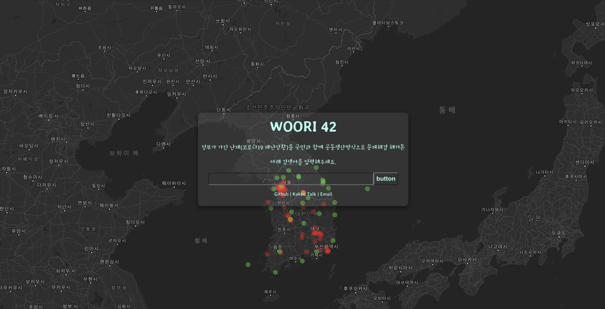
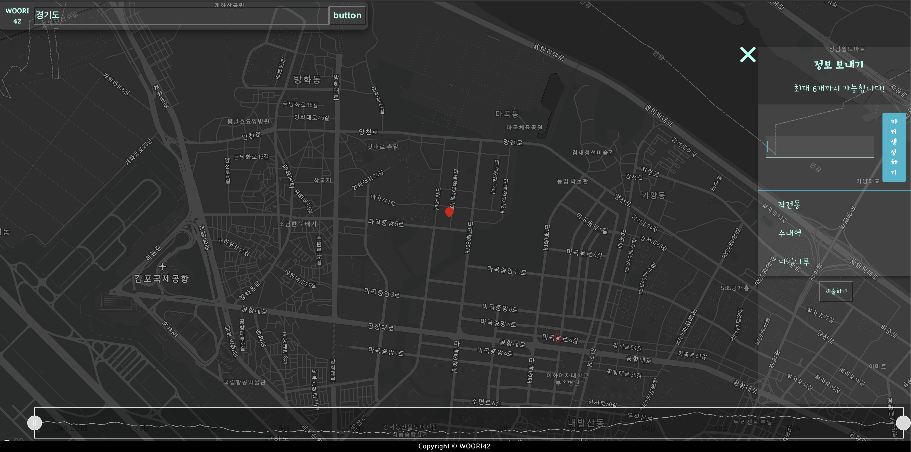

# [빅데이터를 활용한 재난 전파 시각화 예측 시스템] 우리42


<br>

https://www.youtube.com/watch?v=YRMAvvRQmpc&feature=youtu.be  




#### ☕ 제3회 정부혁신제안 끝장개발대회 메이커톤
```
👉 정부가 가진 난제(코로나19 재난상황)를 국민과 함께 공동생산방식으로 문제해결 해커톤
URL: civichack.or.kr
```

<br>

<details>
<summary>  프로젝트 소개 글 (눌러서 내용보기) </summary>
<div markdown="1">
<br>
저희 프로젝트는 코로나와 관련한 정부의 공공 데이터를 시각적으로 한 눈에 들여다보기 용이하도록 가공하였습니다.  국민들이 언제 어디서나 안심 병원, 선별진료소 등을 쉽게 찾아갈 수 있도록 도울 수 있으며, 정보를 조회하는 과정에서 확진 의심환자의 익명 데이터와 정부의 공공데이터를 함께 활용해 코로나 확진 의심 지역을 빠르게 예측할 수 있습니다.

코로나에 감염이 의심되는 환자가 저희 어플리케이션을 활용한다면 많은 정보를 기대할 수 있습니다.  첫째, 지난 수 일간의 동선을 손쉽게 지도에 입력하여, 정부에서 발표한 확진자와 동선이 겹치는 곳이 있는지 빠르게 확인할 수 있습니다. 둘째, 동선을 확인하는 과정을 기록해 데이터베이스에 익명으로 저장하여, 의심 환자가 급증하는 지역을 조기에 발견할 수 있습니다. 이를 통해 전염병의 확산을 예방하고, 피해 규모를 줄일 수 있습니다.

</div>
</details>

<details>
<summary>  제안 이유 (눌러서 내용보기) </summary>
<div markdown="1">
<br>

저희는 기존에 서비스되고 있는 코로나 관련 어플리케이션들을 분석한 결과, 다음과 같은 아쉬움이 존재한다는 것을 확인하였습니다. 

첫째, 다량의 정보를 대시보드 형태로 띄운 서비스의 경우, 사용자들의 정보 수용력이 떨어졌습니다. 아무리 많은 정보가 주어져도 정보를 빠르게 습득할 수 없다면, 이는 국가 전방위적 대응에 효율적으로 활용되기 어렵습니다.  공개 데이터들을 효과적으로 표현하는 것만으로도 신속한 대응을 기대할 수 있습니다. 더 나아가 가공된 데이터로 유의미한 경향성을 도출할 수 있다면, 국내의 부족한 대응 자원을 효율적으로 활용하는데 큰 도움이 될 것입니다.

둘째,  길 찾기와 지역 정보 전달에 최적화 된 국내 지도를 활용한 서비스의 경우, 정보를 효과적으로 전달하기 위한 시각화 도구가 부족했습니다. 저희는 이러한 문제점들을 해결하기 위해, 다양한 시각 효과를 개발자가 자유롭게 구현할 수 있는 오픈 소스 맵 'mapbox'를 활용하였습니다. 지도에 나타나는 데이터 또한 최상의 시각적 효과를 가지기위해 애니매이션으로 구현했습니다.

</div>
</details>

<details>
<summary>  출품작의 역할(아이디어가 실현되었을 때의 역할) (눌러서 내용보기) </summary>
<div markdown="1">
<br>
저희 어플리케이션의 사용을 통해 기대할 수 있는 역할은 다음과 같습니다.

첫째. 코로나 확진이 의심되는 환자에게 간단한 설문을 진행하고, 이를 활용해 상황에 적절한 대응 방안을 제시할 수 있습니다.
둘째. 최근 동선을 입력받고, 확진 환자의 동선과 일치하는지 혹은 유의해야 할 사건들이 주변에서 발생했는지를 알려줄 수 있습니다.  설문의 결과에 따라 가중치를 반영해 데이터베이스에 익명으로 저장합니다.
셋째. 정부 공식 발표 확진자의 동선과, 어플리케이션 사용자들의 이용 분석 결과를 합쳐 장소별 위험도를 평가히여 제공합니다. 
넷째. 사용자의 현재 위치에 따라 선별 진료소와 국민 안심 병원등의 위치를 정부 공개 데이터를 활용하여 제공합니다.

</div>
</details>

<details>
<summary>  기대 효과(출품작 실현시 기대효과) (눌러서 내용보기) </summary>
<div markdown="1">
<br>
저희 어플리케이션으로 축적된 데이터를 활용한다면

첫째. 설문 결과를 바탕으로 확진 확률이 높게 평가 된 사용자에게 효과적으로 대응 방안을 전달할 수 있습니다. 
둘째. 코로나 의심 환자들이 많은 것으로  평가되는 지역을 빠르게 파악하고 예방하여, 바이러스의 광범위한 확산을 방지할 수 있습니다.
셋째. 데이터가 쌓인 후 SNS 공유 기능과 데이터 신뢰도 평가 기능을 덧붙여 민관의 보다 적극적인 협력을 기대할 수 있습니다.

</div>
</details>

<details>
<summary>  제작 과정(아이디어가 실현되는 예상 과정) (눌러서 내용보기) </summary>
<div markdown="1">
<br>
<아이디어 구상>
- 코로나 뿐만 아니라 다양한 전염병에 두루 사용될 수 있는 범용적인 재난 대응 시스템을 만들기 위해 아이디어를 모았습니다. 그렇게 합의된 상황으로는 
 첫째. 집단의 힘을 이용해 실시간으로 데이터를 수집하자.
 둘째. 남녀노소 누구나 쉽게 접근할 수 있도록 플랫폼인 반응형 웹 어플리케이션을 만들기로 했습니다. 
 셋째. 이렇게 모은 데이터를 시각적으로 한눈에 나타낼 수 있도록 데이터를 지도 위에 표현하고 시간 순서에 따라 전염병의 확산 현황을 확인할 수 있게 타임라인을 만들기로 합의했습니다.

<오픈 데이터 조사>
- 회의를 통해 구상된 데이터 맵을 만들기 위해 어떤 데이터를 가공해 지도 위에 시각적으로 표현할지 고민했습니다. 그렇게 합의된 내용은
 첫째. 현재 가장 심각한 전염병인 코로나에 초점을 맞추자. 
 둘째. 코로나와 관련된 공공 데이터인 선별 진료소 현황, 국민안심병원 현황 등을 지도에 같이 표시하자.
 셋째. 코로나 기본 수칙 등 여러 부가정보를 함께 제공하자.

<기술>
- 오픈데이터 조사까지 마친 후 저희는 어떤 기술을 사용해 어플리케이션을 제작할지 논의 했습니다. 논의 결과 기존에 많이 활용되던 카카오나 네이버 지도는 데이터를 시각적으로 표현하는데 한계가 있다고 생각해 오픈 소스 맵인 "MapBox"를 기본으로 React를 사용해 제작하기로 했습니다. 이후 전처리를 통해 공공데이터 가공하고 가공한 데이터를 프로그래밍을 통해 클라이언트에 띄웠습니다. 그리고 동작 테스트 후 Github과 Heroku를 이용해 배포했습니다.


</div>
</details>

<details>
<summary>  적용 기술(출품작 실현에 필요한 적용 기술) (눌러서 내용보기) </summary>
<div markdown="1">
<br>
Heroku, React, Express, Mab Box, Google Map API, Swagger, SCSS
<br>

</div>
</details>

<details>
<summary> 적용 공공 데이터(프로젝트 실현에 필요한 공공데이터) (눌러서 내용보기) </summary>
<div markdown="1">
<br>
Open API
- 코로나 확진자 현황, 전국 선별진료소 현황, 국민 안심 병원 현황

</div>
</details>

<br>
<details>
<summary>  일정 (눌러서 내용보기) </summary>
<div markdown="1">

|  | 일시 | 행사|
|:--------|:--------:|:--------:|
| 7월 24일 | 15: 00 | 해커톤 웹페이지 오픈 |
|  | 15:00 ~ 16:00 | 온라인 등록 |
|  | 16:00 ~ 17:30 | 개회식 및 코로나 19와 공공데이터 토크 콘서트 |
| 7월 24일 ~ 7월 25일 | 17:30 ~ 13:00 | 정부 혁신 제안 온라인 해커톤 |
| 7월 25일 | 14:00 ~ 14:50 | 결과 제출 및 발표 |
|  | 14:50 ~ 15:00 | 마무리 및 폐획 |

</div>
</details>

<details>
<summary>  Swagger (눌러서 내용보기) </summary>
<div markdown="1">

https://app.swaggerhub.com/apis-docs/hochan222/WooRI42/1.0.0  

</div>
</details>

<details>
<summary>  Commit 정책 (눌러서 내용보기) </summary>
<div markdown="1">

🥇 **Commit Message 정책**을 정해봐요.

앞에 문구 종류: https://blog.ull.im/engineering/2019/03/10/logs-on-git.html
좋은 git 커밋 메시지를 작성하기 위한 8가지 약속: https://djkeh.github.io/articles/How-to-write-a-git-commit-message-kor/
Commit Message 바꾸기: http://tech.javacafe.io/2018/03/01/how-to-change-git-commit-message/

**<정책>**
1. 커밋은 다음과 같은 형식으로 지정한다.

[커밋 종류]: 파일명 / 내용 (Pull requests 번호 링크)

**- 커밋 종류**

**[FIX]**: 파일명 / 내용 (Pull requests 번호)
Description: **코드 버그 수정**

**[CREATE]**: 파일명 / 내용 (Pull requests 번호)
Description: **코드파일, 디렉토리 생성**

**[COMPLETE]**: 파일명 / 내용 (Pull requests 번호)
Description: **더이상 추가사항 없을시**

**[REMOVE]**: 파일명 / 내용 (Pull requests 번호)
Description: **불필요한 파일, 디렉토리 제거**

**[REFACTOR]**: 파일명 / 내용 (Pull requests 번호)
Description: **[FIX], 불필요한 주석 제거, 간소화**

</div>
</details>
<br>

<details>
<summary> 참고 자료 (눌러서 내용보기) </summary>
<div markdown="1">

홍보 채널

- http://www.innogov.go.kr/ucms/bbs/B0000001/view.do?nttId=4117&menuNo=300115&pageIndex=1  

- https://www.facebook.com/2020civichack/?ref=page_internal  

소개 영상
- https://www.youtube.com/watch?v=hgnj699VLHA  

Github
- https://github.com/innogovKOR?fbclid=IwAR0TY-rU7o2HgyXaqIzsNJQNigj60RbvdnbIP-Ckca73lNiGOtV3GL3w4Pc  

기획 과정
- https://hackmd.io/@L66Bg-CgS2208qXEJ7ECFA/ryhI-NTOL  

정책
- file:///Users/leehochan/Downloads/%EB%AC%B8%EC%9E%AC%EC%9D%B8%EC%A0%95%EB%B6%80%20%EC%A0%95%EB%B6%80%ED%98%81%EC%8B%A0%203%EC%A3%BC%EB%85%84%20%EC%84%B1%EA%B3%BC%EC%9E%90%EB%A3%8C%EC%A7%91.pdf  

아이디어 예시
- file:///Users/leehochan/Downloads/2019%20%EC%A0%95%EB%B6%80%ED%98%81%EC%8B%A0%20%EC%82%AC%EB%A1%80%EC%A7%91(%EC%9B%B9%EC%9A%A9%20%EC%A0%80%EC%9A%A9%EB%9F%89).pdf
위 파일에서 4번  

- file:///Users/leehochan/Downloads/2020%20%EC%A0%95%EB%B6%80%ED%98%81%EC%8B%A0%20%EC%A2%85%ED%95%A9%20%EC%B6%94%EC%A7%84%EA%B3%84%ED%9A%8D.pdf
위 파일에서 17p  

사례  
- https://now.k2base.re.kr/portal/trend/mainTrend/view.do?poliTrndId=TRND0000000000039185&menuNo=200043&pageUnit=10&pageIndex=1
</div>
</details>
